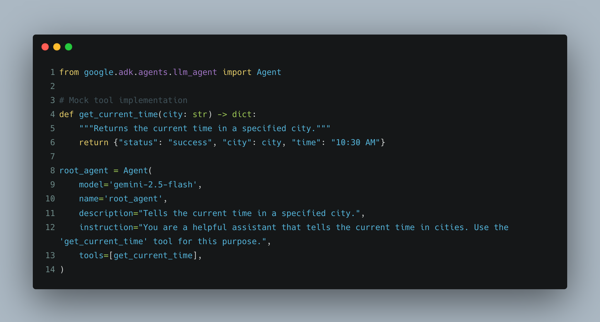
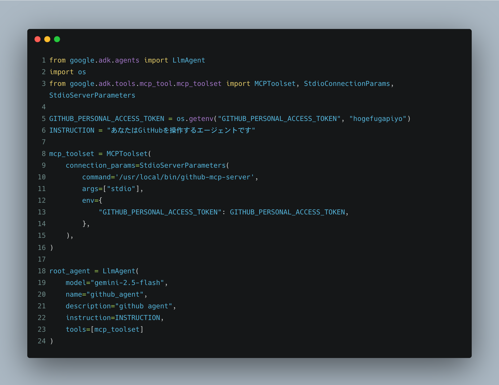
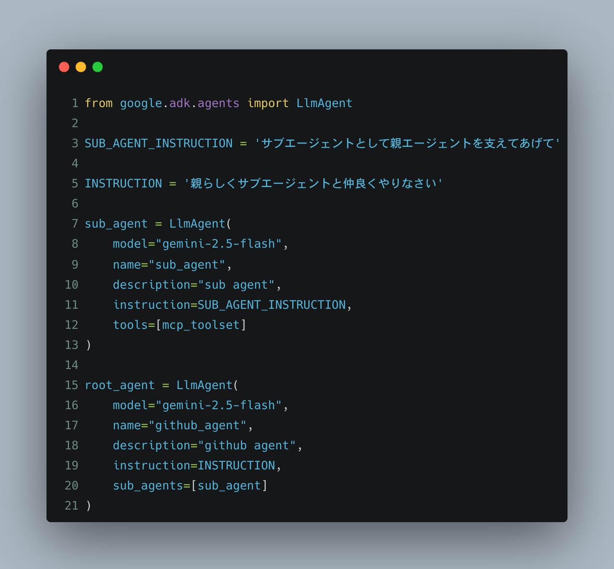
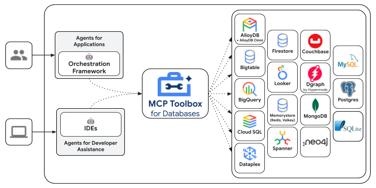
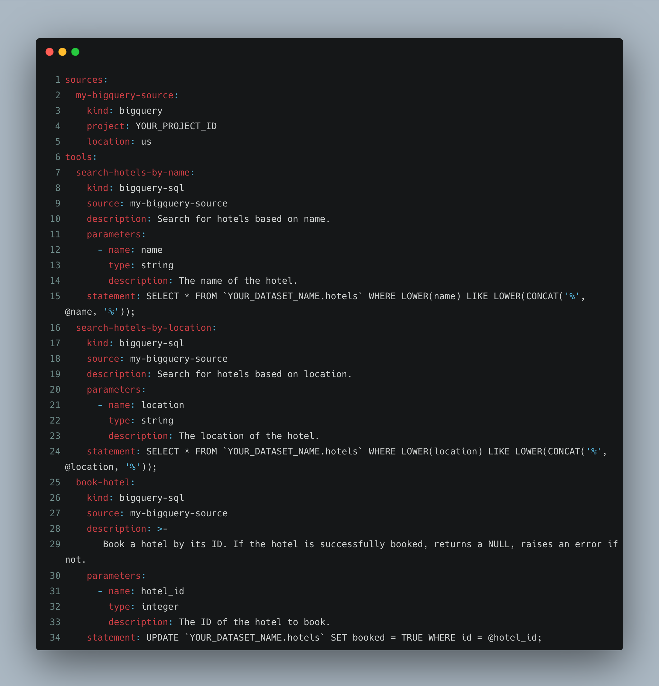

# ADK + toolbox を使ってデータマネジメントやってみた話

hiracky16 (ひらき)

---

# 自己紹介

- 名前: Noriaki Hiraki (X: [hiracky16](https://x.com/hiracky16))
- 所属: ファインディ株式会社 データエンジニア
- 興味: サッカー観戦⚽️、ハロプロ💃、ポッドキャスト🎙️、子育て👶
- ひとこと: 9 月に福岡に引っ越してきました🍜よろしくお願いします！（出身は熊本🐻）

---

# 今日お話すること
- データマネジメントの難しさについて
- Ops に AI を組み込むことのメリット
- ADK と Toolbox について
- デモ（企業マスタのメンテナンス）
- まとめ

---
# データマネジメントとは？

> 企業が保有するデータを、目的の利用目的に応じていつでも活用できる状態を維持し、継続的に管理していく組織的な取り組みです。データの登録、更新、蓄積、アーカイブ、破棄など、データのライフサイクル全体を管理し、品質向上と効率的な利活用を目指します。

データマネジメントを継続的に回すためデータガバナンスがあり、現場の Ops に対してガバナンスを効かせることが非常に重要

---
# データライフサイクルにおける課題感
- 登録: 決めたルールで入力されない
- 更新: 一度入力して最新化されない
- 蓄積: 決められた場所に保存されない
- 破棄: 古く使われていないデータがそのまま残っている
- 決めたルールやオペレーションを運用するのに様々なコストが掛かってしまう
  - AI によって簡単にできないだろうか…？🤔

---

# ADK（Agent Developement Kit） とは？

- Google 製の AI エージェント開発・展開のための柔軟なフレームワーク
- Gemini と Google エコシステムに最適化されつつ、モデルやデプロイメントに依存しない
- エージェント開発をソフトウェア開発のようにし、複雑なワークフローを容易に構築可能にする

---
# たった 14 行でエージェントが開発できる

---

---

# MCP Toolbox for Database とは？

- Google 製の Database のための MCP サーバー
- MySQL や PostgreSQL, BigQuery, Looker など対応サービスが豊富
- prebuild されたツールや自前のツールを容易に開発可能

---
# YAML でツールを用意

---
# ADK + Toolbox の連携

## どのように組み合わせたか

- Toolbox でデータのライフサイクル（登録〜破棄）を行うツールを開発し MCP サーバーとしてホスティング
- ADK を使って Toolbox MCP のクライアントとして自然言語でデータを操作できるエージェントを開発

## メリット、工夫点

- YAML にデータ登録や更新用の SQL を定義できるため安心
- 自然言語による操作が可能なため Ops への負担が少ない
  - `adk run` による CLI ベースでの実行も可能なため全自動でも可能

---

# デモ（企業マスタのメンテナンス）

- 
- [実施内容]
- [使用した機能/ツール]

---

# 成果・効果

## データマネジメントの改善

- [具体的な改善点1]
- [具体的な改善点2]

## 定量的な効果 (もしあれば)

- [例: 処理時間短縮、コスト削減など]

---

# まとめ

## 直面した課題

- [課題1]
- [課題2]

---

# 今後の展望

- [今後の改善点]
- [新しい取り組み]
- [挑戦したいこと]

---

# ご清聴ありがとうございました！
